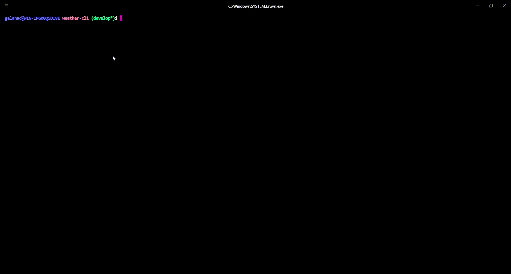

# Check Weather

«Check Weather» is a Command-Line application for getting the weather forecasts. It uses the Open Weather API.




## Installation

First you need is to install the necessary packages:

```
$ pip install -r requirements.txt
```

After you need to run "init" command and input your OpenWeather API Key

```
$ python -m check_weather init
Please input OpenWeather API key: <Your OpenWeather API Key>
```


## Usage

To get the current weather forecast:
```
$ python -m check_weather today <CITY>
```

Get the daily weather forecast for five days:
```
$ python -m check_weather daily <CITY>
```
You can get the detailed weather forecast using `-v` option. Use `-i` to get measures in imperial units


## All Options

```
$ python -m check_weather --help

Usage: check_weather [OPTIONS] COMMAND [ARGS]...

Commands:
    daily          Daily weather forecast for 5 days.
    init           Initialize the OpenWeather API key.
    today          Show today's weather of CITY.

Options:
    --imperial  -i        Display the temprature in imperial units.
    --verbose   -v        Display detailed weather forecast.
    --help                Show help message.


With ♥ by Parviz Yuldoshev
```